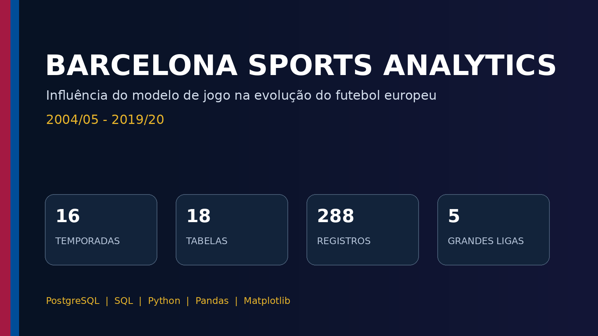
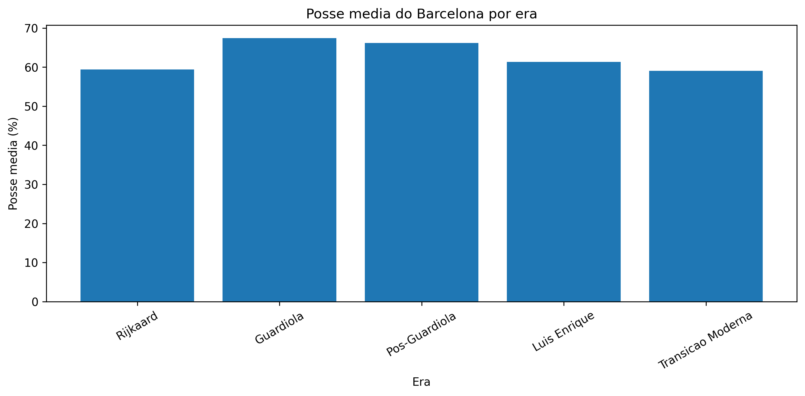
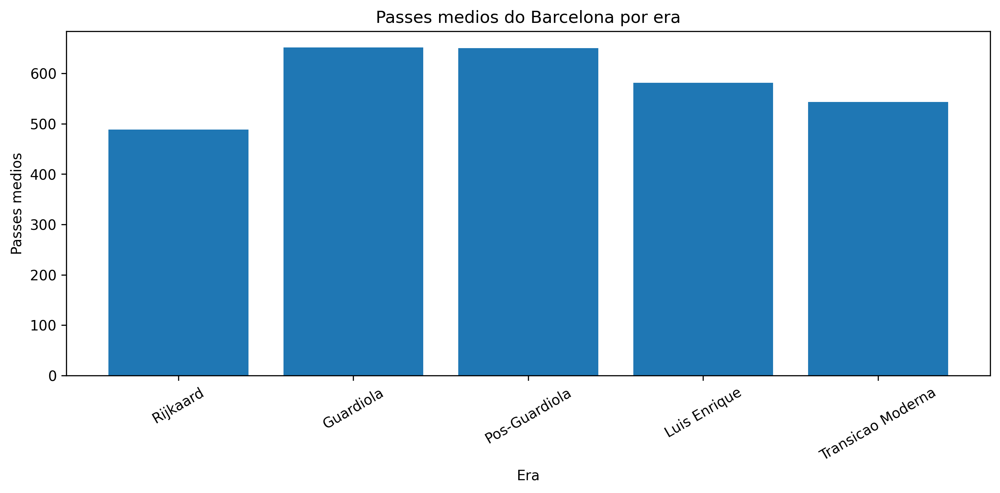
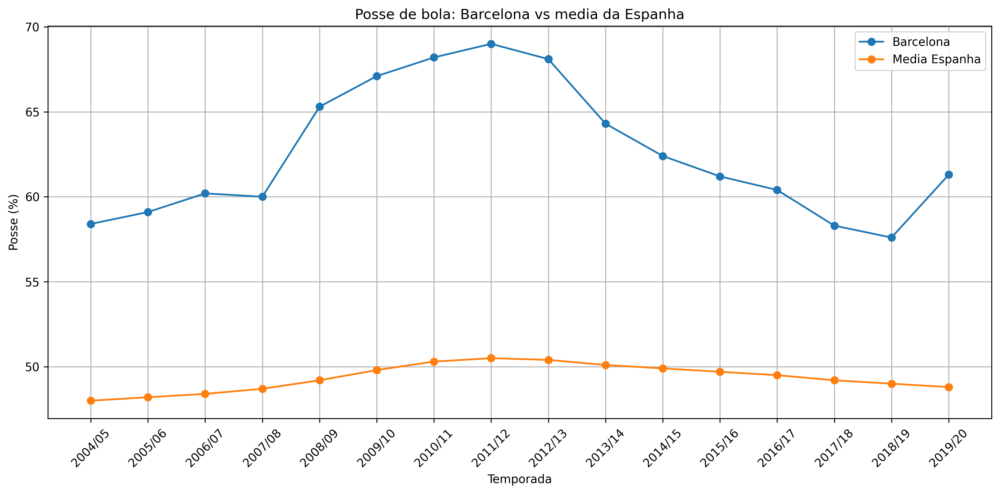
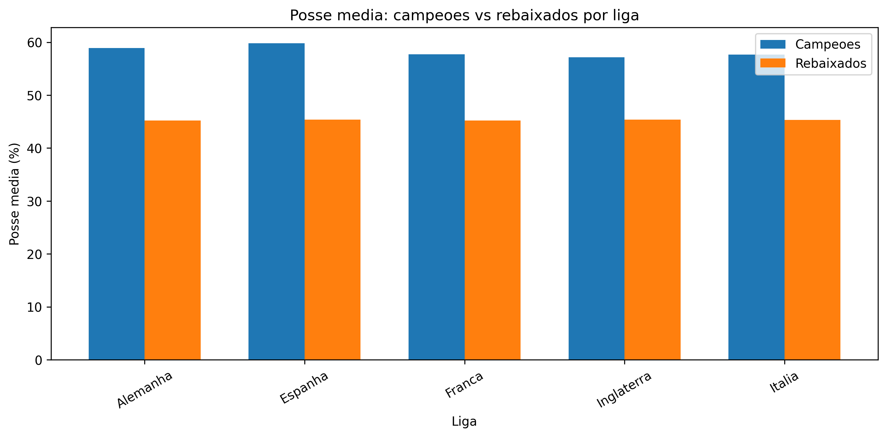
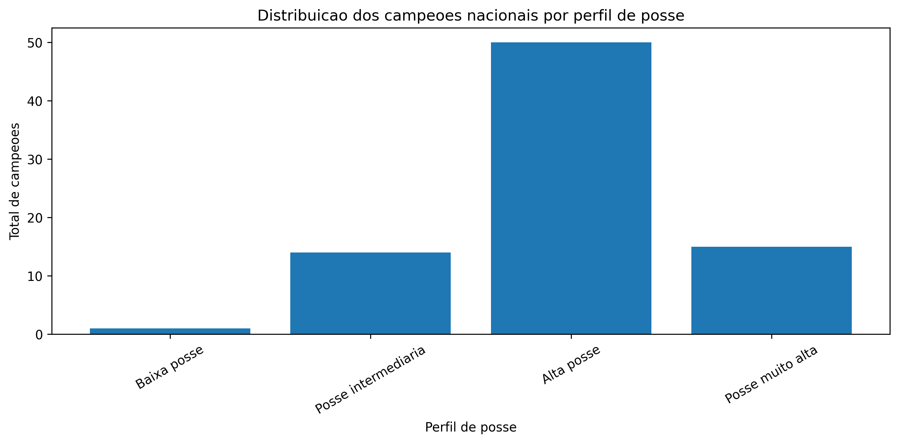
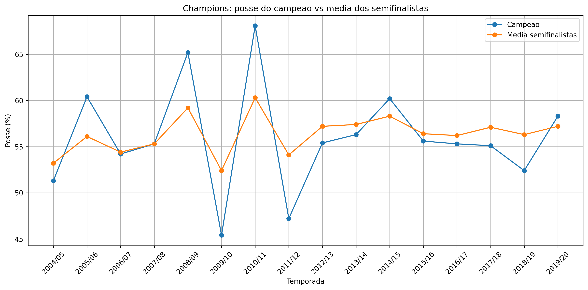

<p align="center">
  
</p>

<h1 align="center">Barcelona Sports Analytics</h1>

<p align="center">
  <strong>Análise quantitativa da influência do modelo de jogo do Barcelona na evolução do futebol europeu entre 2004/05 e 2019/20.</strong>
</p>

<p align="center">
  
  
  
  
  
</p>

## Sobre o projeto

Projeto acadêmico de **Sports Analytics** desenvolvido como Trabalho de Conclusão do Bacharelado em Sistemas de Informação da Universidade de Taubaté (UNITAU).

> **Pergunta de pesquisa:** em que medida o modelo de jogo consolidado pelo Barcelona influenciou a evolução do futebol europeu moderno e até que ponto essa influência pode ser identificada por meio de dados?

O trabalho percorre um pipeline completo: construção e padronização do dataset, validação em PostgreSQL, análise em SQL, visualização em Python e interpretação apoiada pelo contexto histórico e tático.

## Visão rápida

| Dimensão | Escopo |
|---|---:|
| Período analisado | 2004/05–2019/20 |
| Temporadas | 16 |
| Ligas nacionais | 5 |
| Tabelas | 18 |
| Registros | 288 |
| Visualizações | 20 |

**Recortes comparativos:** Barcelona, campeões nacionais, médias das ligas, médias sazonais das equipes rebaixadas, campeões da UEFA Champions League e média dos quatro semifinalistas de cada edição.

## Principais resultados

### 1. O pico estatístico ocorreu na era Guardiola

Na base construída, o Barcelona da era Guardiola registrou média de **67,4% de posse** e aproximadamente **651 passes por jogo**, os maiores níveis de controle e circulação entre as eras analisadas.

<p align="center">
  
  
</p>

### 2. O Barcelona foi um ponto fora da curva na Espanha

A distância para a média da liga espanhola se amplia especialmente no período Guardiola, indicando que o clube não apenas acompanhou uma tendência: apresentou um perfil estatístico excepcional dentro do próprio campeonato.

<p align="center"></p>

### 3. Campeões e rebaixados exibiram perfis distintos

Nos agregados das cinco ligas, os campeões apresentaram médias de **58,3% de posse** e **513 passes por jogo**; as equipes rebaixadas, de **45,3%** e **344 passes**.

O resultado indica associação entre controle, construção e consistência em campeonatos de pontos corridos — não que a posse, isoladamente, garanta títulos.

<p align="center"></p>

### 4. A influência ocorreu por adaptação, não por simples cópia

Dos **80 campeões nacionais** observados, **72** ficaram nas faixas de alta ou muito alta posse definidas no estudo. Ainda assim, o recorte também contém campeões sustentados por transição, organização defensiva, verticalidade e eficiência.

<p align="center"></p>

### 5. A Champions League pede outra leitura

Em torneios eliminatórios, controle estatístico e resultado nem sempre caminham juntos. A análise compara o campeão de cada edição com a **média dos quatro semifinalistas**, evitando tratar um único adversário como representação do torneio.

<p align="center"></p>

## Pipeline analítico

1. Delimitação histórica, tática e temporal.
2. Definição das variáveis observáveis.
3. Construção, limpeza e padronização do dataset.
4. Exportação das 18 tabelas para CSV.
5. Validação de integridade e consistência em PostgreSQL.
6. Consultas SQL para comparação dos recortes.
7. Geração de 20 visualizações em Python.
8. Interpretação dos resultados e registro das limitações.

## Tecnologias

`PostgreSQL` · `SQL` · `Python` · `Pandas` · `Matplotlib` · `Excel` · `Google Colab` · `DBeaver`

## Estrutura analítica

| Arquivo | Finalidade |
|---|---|
| [`00_criacao_tabelas.sql`](00_criacao_tabelas.sql) | Criação e restrições das 18 tabelas |
| [`01_validacao_e_testes.sql`](01_validacao_e_testes.sql) | Testes de integridade, nulos, duplicidade e consistência |
| [`02_analise_barcelona.sql`](02_analise_barcelona.sql) | Evolução do Barcelona por temporada, técnico e era |
| [`03_barcelona_vs_espanha.sql`](03_barcelona_vs_espanha.sql) | Comparação entre Barcelona e média da liga espanhola |
| [`04_campeoes_vs_rebaixados.sql`](04_campeoes_vs_rebaixados.sql) | Comparação entre topo e parte inferior das cinco ligas |
| [`05_campeoes_cinco_ligas.sql`](05_campeoes_cinco_ligas.sql) | Análise conjunta dos 80 campeões nacionais |
| [`06_modelos_resposta_anti_tiki_taka.sql`](06_modelos_resposta_anti_tiki_taka.sql) | Perfis competitivos alternativos ao controle por posse |
| [`07_champions_league.sql`](07_champions_league.sql) | Campeões e semifinalistas da Champions League |
| [`visualizacoes.py`](visualizacoes.py) | Geração reproduzível dos 20 gráficos |

## Como reproduzir

### Visualizações em Python

```bash
git clone https://github.com/MRC888/barcelona-sports-analytics.git
cd barcelona-sports-analytics
python -m venv .venv
pip install -r requirements.txt
python visualizacoes.py
```

O script lê os CSVs da raiz do repositório e salva os novos gráficos em `graficos_gerados/`. Caminhos diferentes podem ser informados por parâmetros:

```bash
python visualizacoes.py --data-dir . --output-dir graficos_gerados
```

### Consultas em PostgreSQL

1. Crie um banco PostgreSQL.
2. Execute `00_criacao_tabelas.sql`.
3. Importe os 18 CSVs da raiz para as tabelas de mesmo nome.
4. Execute `01_validacao_e_testes.sql`.
5. Execute os arquivos analíticos de `02` a `07`, na ordem numérica.

## Metodologia e limitações

O dataset tem finalidade **exploratória e comparativa**.

- Resultados, campeões, jogos e gols foram organizados a partir de registros históricos públicos.
- Posse e passes médios — sobretudo nas temporadas mais antigas — são aproximações estatísticas para comparação histórica, não extrações oficiais de um único fornecedor.
- O estudo identifica associações e tendências; não estabelece causalidade direta.
- O repositório não redistribui dados proprietários de Opta, StatsBomb, Wyscout ou outras plataformas comerciais.

A proveniência, o uso adequado e as limitações estão detalhados em [`FONTES_E_METODOLOGIA.md`](FONTES_E_METODOLOGIA.md).

## Entregáveis

- [Manuscrito completo em PDF](TCC_Barcelona_Manuscrito_Final.pdf)
- [Dataset em Excel](Dataset_TCC.xlsx)
- [Dicionário de dados](data_dictionary.md)
- [Fontes e metodologia](FONTES_E_METODOLOGIA.md)
- [Apresentação do case](Barcelona_Sports_Analytics_Case_LinkedIn.pptx)
- [Arquivo de citação](CITATION.cff)

## Autor

**Marcelo Augusto Pereira Santos**  
Bacharelado em Sistemas de Informação — Universidade de Taubaté (UNITAU)

[GitHub](https://github.com/MRC888) · [LinkedIn](https://www.linkedin.com/in/marcelo-augusto-santos88/)

## Licença

O código Python e os scripts SQL utilizam a [licença MIT](LICENSE-CODE). O dataset, os gráficos, o manuscrito, a apresentação e os textos seguem os termos descritos em [LICENSE](LICENSE).

---

<p align="center"><strong>O Barcelona não apenas ganhou jogos. O Barcelona mudou o jogo.</strong></p>
